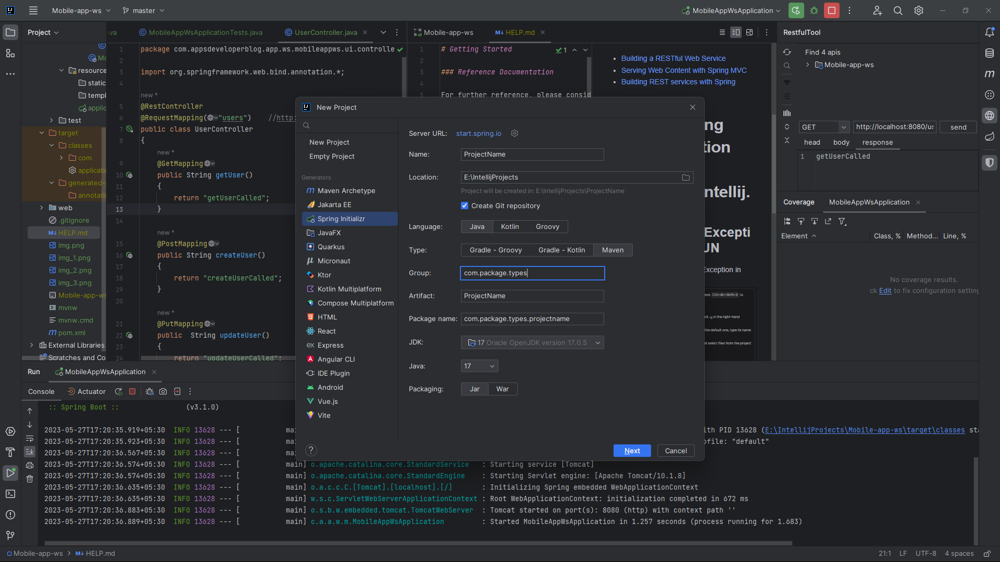
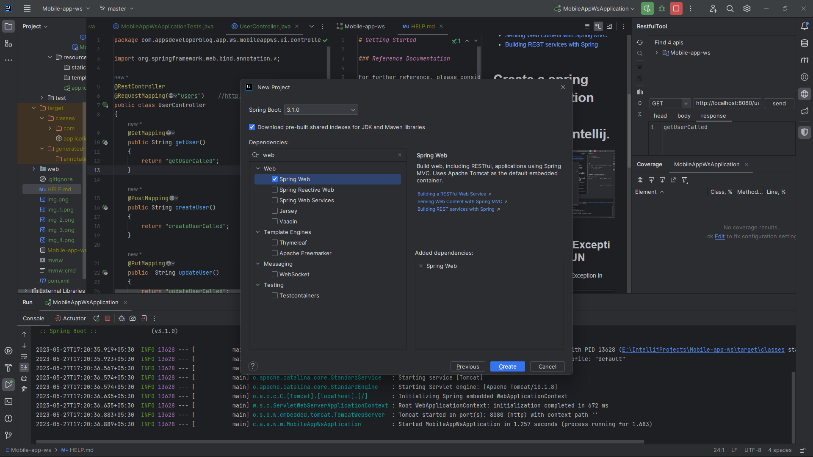
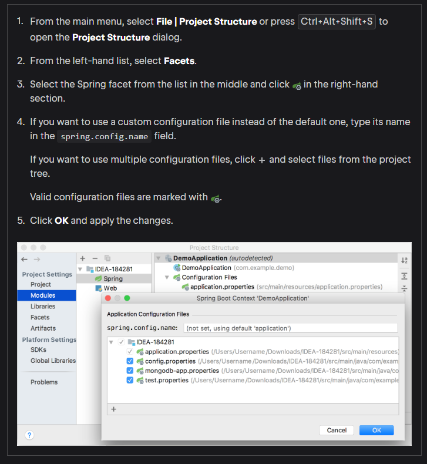
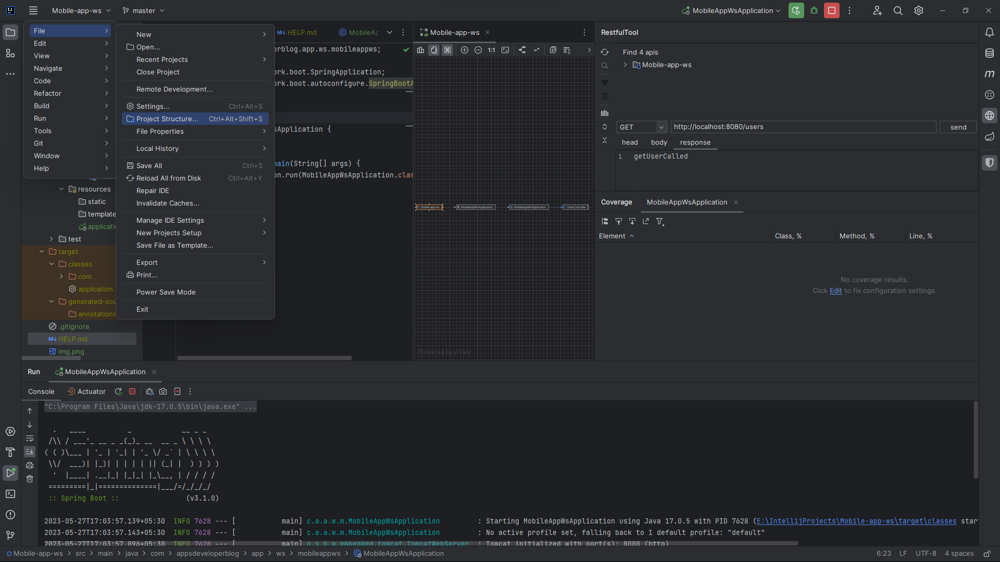
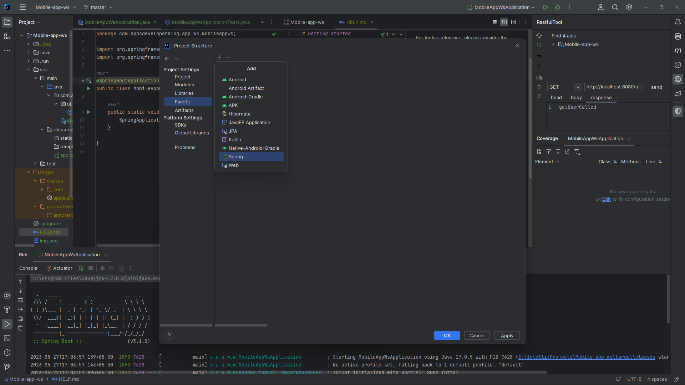
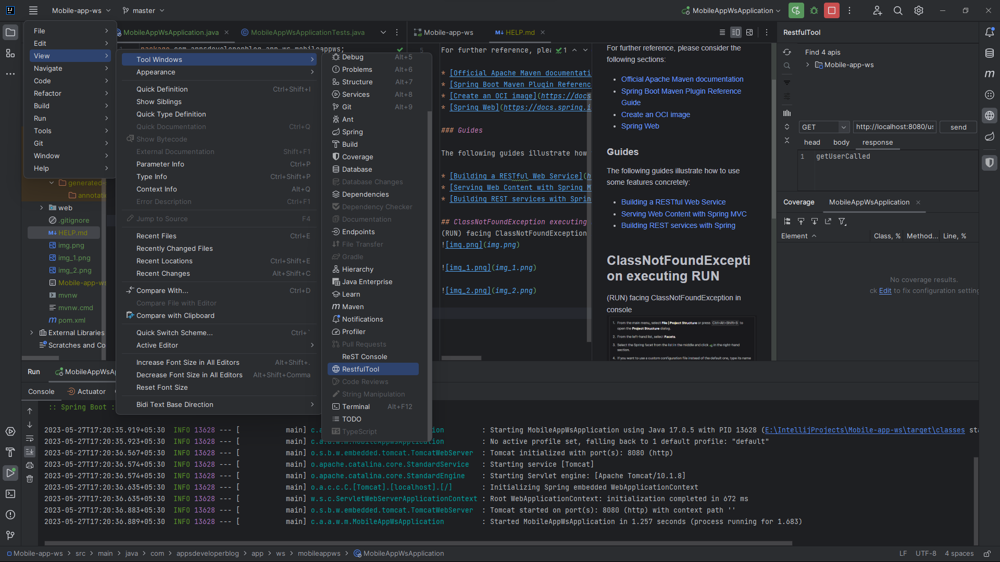

# Getting Started

### Reference Documentation

For further reference, please consider the following sections:

* [Official Apache Maven documentation](https://maven.apache.org/guides/index.html)
* [Spring Boot Maven Plugin Reference Guide](https://docs.spring.io/spring-boot/docs/3.1.0/maven-plugin/reference/html/)
* [Create an OCI image](https://docs.spring.io/spring-boot/docs/3.1.0/maven-plugin/reference/html/#build-image)
* [Spring Web](https://docs.spring.io/spring-boot/docs/3.1.0/reference/htmlsingle/#web)

### Guides

The following guides illustrate how to use some features concretely:

* [Building a RESTful Web Service](https://spring.io/guides/gs/rest-service/)
* [Serving Web Content with Spring MVC](https://spring.io/guides/gs/serving-web-content/)
* [Building REST services with Spring](https://spring.io/guides/tutorials/rest/)

# Create a spring boot application using Spring initializer in intellij.

## Create Controller Package and Java file [UserController](src/main/java/com/appsdeveloperblog/app/ws/mobileappws/ui/controller/UserController.java)
* 

## ClassNotFoundException executing RUN
(RUN) facing ClassNotFoundException in console

## Add Restfull tool in view
Right side of this image, we can see the "getUser" method is called.

#### Create [UserDetailsRequestModel](src/main/java/com/appsdeveloperblog/app/ws/mobileappws/ui/model/request/UserDetailsRequestModel.java)
#### Create [UserDto](src/main/java/com/appsdeveloperblog/app/ws/shared/dto/UserDto.java) - To create serialVersionUID - [StackOverflow](https://stackoverflow.com/a/36007392)
#### Create [UserService](src/main/java/com/appsdeveloperblog/app/ws/service/UserService.java)
#### Create [UserServiceImpl](src/main/java/com/appsdeveloperblog/app/ws/service/impl/UserServiceImpl.java)
#### Create [UserEntity](src/main/java/com/appsdeveloperblog/app/ws/io/entity/UserEntity.java)
#### Create [UserRepository](src/main/java/com/appsdeveloperblog/app/ws/repository/UserRepository.java)

Run the App
- [Error creating bean with name 'dataSourceScriptDatabaseInitializer'](https://stackoverflow.com/a/31199853)
- Add (exclude={DataSourceAutoConfiguration.class}) after [@SpringBootApplication](src/main/java/com/appsdeveloperblog/app/ws/mobileappws/MobileAppWsApplication.java)

